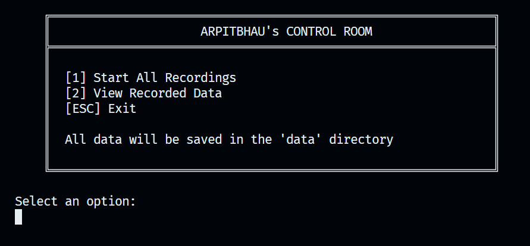

                                                                                
# I See You - Multi-Stream Surveillance System

A powerful desktop surveillance suite that simultaneously captures:
- 🎥 Screen Activity
- 📹 Webcam Feed  
- 🎤 Audio Recording
- ⌨️ Keystroke Logging

## Features

- Real-time synchronized multi-stream monitoring
- Automatic session management with timestamps
- Minimal UI with keyboard shortcuts

## Installation

1. Install Python 3.x from [python.org](https://www.python.org/downloads/)

2. Install FFmpeg:
   - Windows: Download from [ffmpeg.org](https://ffmpeg.org/download.html)

3. Clone the repository:
   ```bash
   git clone https://github.com/yourusername/i-see-you.git
   cd i-see-you
   ```

4. Install required Python packages:
   ```bash
   pip install -r requirements.txt
   ```


## Usage

1. Launch the program: `py main.py`
<br>


## Requirements

- Python 3.x
- FFmpeg
- Required Python packages:
  - pynput
  - keyboard
  - opencv-python
  - pyaudio
  - numpy
  - pillow


## Data Storage

- Data is stored in the `data` folder
- Each session is stored in a separate subfolder with a timestamp
- Audio and video are merged into a single file for each session after the recording is stopped

